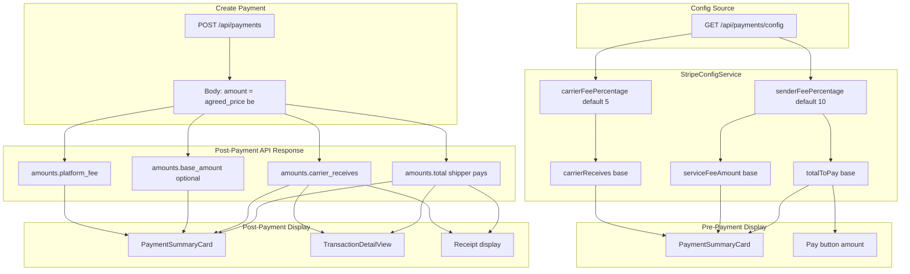

# Payment Data Flow (Dual-Fee Model)

This document describes the data flow for payment and payout in the Pasabayan iOS app under the dual-fee model.

## Fee Model Summary

| Party | Calculation | Example (base $10) |
|-------|-------------|-------------------|
| **Sender (Shipper)** | Pays base + 10% | $11 |
| **Carrier** | Receives base − 5% | $9.50 |
| **Platform** | 10% + 5% of base = 15% | $1.50 |

---

## Data Flow Diagram

---

## Flow Stages

### 1. Config Fetch (App Launch / Auth)

- **Endpoint:** `GET /api/payments/config`
- **When:** On app launch (authenticated) and on login
- **Service:** `StripeConfigService`
- **Data:** `sender_fee_percentage`, `carrier_fee_percentage`, `platform_fee_percentage`, `min_delivery_price`, Stripe keys

### 2. Pre-Payment (Before createPayment)

- **Source:** `StripeConfigService` fee helpers + `match.agreedPrice` (base)
- **Calculation:**
  - Base = agreed_price
  - Service fee = base × (sender_fee_percentage / 100)
  - Total you'll pay = base × (1 + sender_fee_percentage / 100)
  - Carrier receives = base × (1 − carrier_fee_percentage / 100)
- **Display:** `PaymentSummaryCard`, Pay button label

### 3. Create Payment

- **Endpoint:** `POST /api/payments`
- **Body:** `{ delivery_match_id, amount: agreed_price, currency }`
- **Note:** Always send base (agreed price) only; backend adds sender fee.

### 4. Post-Payment (API Response)

- **Source:** `data.amounts` from create/transaction/receipt endpoints
- **Key fields:** `total`, `carrier_receives`, `platform_fee`, `base_amount` (optional)
- **Display:** Use `amounts.total` for "Total paid", `amounts.carrier_receives` for "Carrier receives"

### 5. Receipts

- **Shipper:** `amount.total` = total paid
- **Carrier:** `amount.carrier_amount` = carrier payout

---

## Key Files

| File | Role |
|------|-|
| `StripeConfigService.swift` | Fetches config, exposes fee helpers |
| `StripeConfigModels.swift` | Parses sender/carrier fee % from API |
| `PaymentButton.swift` | PaymentSummaryCard, Pay amount |
| `PaymentViewModel.swift` | createPayment, uses response amounts |
| `PaymentModels.swift` | TransactionAmounts, base_amount optional |
| `TransactionDetailView.swift` | Uses amounts.total, amounts.carrier_receives |
| `PaymentReceiptModels.swift` | amount.total, amount.carrier_amount |

---

## API Contract (Reference)

| Endpoint | Key Response Fields |
|----------|---------------------|
| `GET /api/payments/config` | `sender_fee_percentage`, `carrier_fee_percentage` |
| `POST /api/payments` | `data.amounts.total`, `data.amounts.carrier_receives`, `data.amounts.base_amount` |
| `GET /api/payments/{id}` | Same amounts structure |
| `GET /api/receipts` | `amount.total`, `amount.carrier_amount` |
